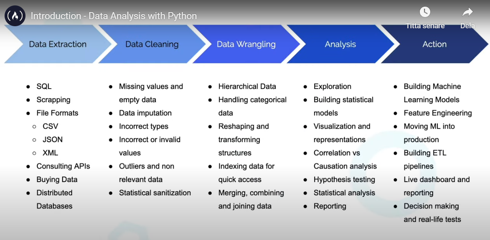
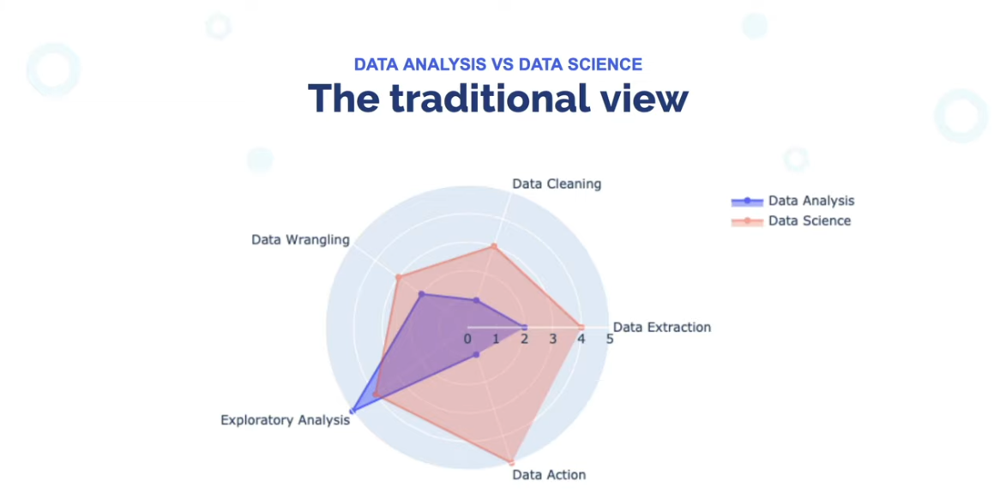

# Data Analysis with Python (freeCodeCamp)<!-- omit in toc -->

1. [Requirements](#requirements)
2. [Courses to learn the ropes](#courses-to-learn-the-ropes)
3. [1. Data Analysis](#1-data-analysis)
4. [2. Jupyter Notebooks](#2-jupyter-notebooks)
5. [3. NumPy](#3-numpy)
6. [4. Pandas](#4-pandas)
7. [5. Data Cleaning](#5-data-cleaning)
8. [6. Reading Data](#6-reading-data)
9. [7. Python](#7-python)
10. [Projects](#projects)

In the [Data Analysis with Python Certification](https://www.freecodecamp.org/learn/data-analysis-with-python/), you'll learn the fundamentals of data analysis with Python. By the end of this certification, you'll know how to read data from sources like CSVs and SQL, and how to use libraries like Numpy, Pandas, Matplotlib, and Seaborn to process and visualize data.

Start date: 2025-02-15

End date: 2025-02-26

[Certificate](https://www.freecodecamp.org/certification/Henrik_Enquist/data-analysis-with-python-v7)

[My GitHub repo](https://github.com/henrikenquist/data_analysis_with_python)

## Requirements

Store dependencies:

**NOTE:** Activate the virtual environment first!

`.venv\Scripts\activate`

`pip freeze --local > requirements.txt`

Install dependencies:

`pip install -r requirements.txt`

## Courses to learn the ropes

We are still developing the interactive instructional part of the Python curriculum. For now, here are some videos on the freeCodeCamp.org YouTube channel that will teach you everything you need to know to complete this project:

- [Python for Everybody Video Course (14 hours)](https://www.freecodecamp.org/news/python-for-everybody/) (Taken 2021)
- [How to Analyze Data with Python Pandas (10 hours)](https://www.freecodecamp.org/news/how-to-analyze-data-with-python-pandas/)

## 1. Data Analysis

[Lecture 1 resources on GitHub](https://github.com/ine-rmotr-curriculum/FreeCodeCamp-Pandas-Real-Life-Example)

### Lecture notes

High level understanding of the process and the tools.

- From file to DataFrame: df.read_csv(), df.read_-sql()
- Example data: df.head()
- Size: df.shape()
- Column info: df.info()
- Descriptive statistics: df.describe()
- Counts: df.value_counts()
- Plots: density, box, histogram, pie, bar
- Correlations: plt.matshow, scatter
- Use control columns ("checks and balances")
- Data wrangling
- Selection an dindexing: df.loc

## 2. Jupyter Notebooks

[Lecture 2 resources on GitHub](https://github.com/ine-rmotr-curriculum/ds-content-interactive-jupyterlab-tutorial)

### Lecture notes

- keyboard shortcuts
- importing and exporting data
- matplotlib vs bokeh vs seaborn

**NOTE:** VSCode shortcuts differ from lecture and Jupyter shortcuts.

## 3. NumPy

[Lecture 3 resources on GitHub](https://github.com/ine-rmotr-curriculum/freecodecamp-intro-to-numpy)

### NumPy videos

[NumPy](https://numpy.org/) - The fundamental package for scientific computing with Python

- [What is NumPy](https://www.youtube.com/watch?v=5Nwfs5Ej85Q)
- [Basics of NumPy](https://www.youtube.com/watch?v=f9QrZrKQMLI)
- [Accessing and Changing Elements, Rows, and Columns](https://www.youtube.com/watch?v=v-7Y7koJ_N0)
- [Initializing Different Arrays](https://www.youtube.com/watch?v=CEykdsKT4U4)
- [Initialize Array Problem](https://www.youtube.com/watch?v=0jGfH8BPfOk)
- [Copying Arrays Warning](https://www.youtube.com/watch?v=iIoQ0_L0GvA)
- [Mathematics](https://www.youtube.com/watch?v=7txegvyhtVk)
- [Reorganizing Arrays](https://www.youtube.com/watch?v=VNWAQbEM-C8)
- [Loading Data and Advanced Indexing](https://www.youtube.com/watch?v=tUdBZ7pF8Jg)

### Lecture notes

- numpy is often used via other packages, e.g. pandas.
- Multi-indexing: a[[0,2,-1]] -> numpy array: array(0.0, 1.6, 5.3)
- a[1, 0] instead of a[1][0]; permits slicing
- a[1] = 99 instead of a[1] = np.array([99, 99, 99])
- WARNING: my intuition of axis=0 for sum() etc. is wrong, instead think 'row-wise'
  - a.sum(axis=0) sums the elements like so: [sum(col 0), sum(col1), sum(col2)]
- Broadcast and vectorized operations
- Boolean selection: a[[True, False, False, True]]
- Check size, sys: sys.getsizeof(10**100)
- Check size, numpy: np.dtype(int).itemsize
- Time an operation: %time np.sum(a ** 2)

### Useful numpy functions

- random
- arange
- reshape
- linspace
- zeros, ones, empty
- identity, eye

## 4. Pandas

[Lecture 4 resources on GitHub](https://github.com/ine-rmotr-curriculum/freecodecamp-intro-to-pandas)

### Series

- Behaves like a combo of array and dict
- Indexing **INCLUDES** upper limit unlike vanilla Python!
- s.name
- s.values
- s.index
  - Can be labeled/named
  - Still ordered!

### DataFrames

- Looks like Excel spreadsheet (i.e. a table)
- Useful variables/methods:
  - columns
  - index
  - info()
  - size
  - shape
  - describe()
  - dtypes
  - dtypes.value_count()
- Indexing -> Series
  - loc[index/row label]
  - iloc[index number (position)] (upper limit **not** included)
  - loc[column label]
  - to_frame()
- Index -> column.name

**Tip**

Always use `loc` and `iloc` to reduce ambiguity, specially with DataFrames with numeric indices.

### Pandas Conditional Selection and Modifying DataFrames

`df['Population'] > 70`

`df.loc[df['Population'] > 70]`

`df.loc[df['Population'] > 70, 'Population']`

- drop (doesn't remove the data from the original df)
- rename (immutable, doesn't change the original df)

### Reading CSV and plotting

- to_datetime
- set_index
- df.plot 

## 5. Data Cleaning

[Lecture 5 resources on GitHub](https://github.com/ine-rmotr-curriculum/data-cleaning-rmotr-freecodecamp)

### Lecture notes

1. Missing data
   1. Removing columns/rows
   2. Imputing data
   3. Useful functions/methods
      1. isnull <-> isna
      2. notnull <-> notna
      3. df.isnull(s).sum()
      4. s.dropna()
      5. s.dropna().count()
      6. df.dropna() along axis
      7.  df.dropna(how='all')
      8.  df.dropna(how='any')
      9.  df.dropna(thresh=3)
      10. s.fillna(s.mean())
      11. s.fillna(method='ffill'): forward fill
      12. s.fillna(method='bfill', axis=0): backward fill, row-wise
      13. s.all() s.any() 
2. Invalid data
   1. Domain/context specific
   2. df['Sex'].unique()
   3. df['Sex'].value_counts()
   4. df['Sex'].replace({'D': 'F', 'N': 'M'})
3. Duplicates
   1. s.duplicated()
   2. s.duplicated(keep='last')
   3. s.duplicated(keep=False), all instances considered duplicates
   4. s.drop_duplicates(keep=False), all instances considered duplicates and dropped
   5. s.duplicated(subset=['Name'])
4. String handling
   1. df['Data'].str.split('_', expand= True)
   2. contains
   3. strip
   4. replace
   5. regex
5. Plotting
   1. matplotlib: Global API vs OOP API
      1. TIP: Use the OOP version
   2. scatter
      1. cmap
   3. colorbar
   4. bar
   5. hist
   6. boxplot

## 6. Reading Data 

[Lecture 6 resources on GitHub](https://github.com/krishnatray/RDP-Reading-Data-with-Python-and-Pandas)

### Lecture notes

- read_csv
  - xlsx
- read_json
- read_sql
  - pd.read_sql(query, conn)
    - pd.read_sql_query(query, conn)
    - pd.read_table(engine, con=conn) needs SQLAlchemy
- read_html
- read_excel
- pd.ExcelFile
  - pd.ExcelFile.parse(sheetname) needs openpyxl
- pd.ExcelWriter

## 7. Python 

[Lecture 7 resources on GitHub](https://github.com/ine-rmotr-curriculum/ds-content-python-under-10-minutes)

## Projects

### Mean-Variance-Standard Deviation Calculator

Basic statistics, including mean, variance, and standard deviation.

- [Challenge](https://www.freecodecamp.org/learn/data-analysis-with-python/data-analysis-with-python-projects/mean-variance-standard-deviation-calculator)
- [Boilerplate code](https://gitpod.io/?autostart=true#https://github.com/freeCodeCamp/boilerplate-mean-variance-standard-deviation-calculator/)

### Demographic Data Analyzer

Selecting data from a Pandas DataFrame along certain axes and perform simple calculations.

- [Challenge](https://www.freecodecamp.org/learn/data-analysis-with-python/data-analysis-with-python-projects/demographic-data-analyzer)
- [Boilerplate code](https://gitpod.io/?autostart=true#https://github.com/freeCodeCamp/boilerplate-demographic-data-analyzer/)

### Medical Data Visualizer

Visualize and make calculations from medical examination data using matplotlib, seaborn, and pandas. 

- [Challenge](https://www.freecodecamp.org/learn/data-analysis-with-python/data-analysis-with-python-projects/medical-data-visualizer)
- [Boilerplate code](https://gitpod.io/?autostart=true#https://github.com/freeCodeCamp/boilerplate-medical-data-visualizer/)

### Page View Time Series Visualizer

Visualize time series data using a line chart, bar chart, and box plots. You will use pandas, matplotlib, and seaborn.

- [Challenge](https://www.freecodecamp.org/learn/data-analysis-with-python/data-analysis-with-python-projects/page-view-time-series-visualizer)
- [Boilerplate code](https://gitpod.io/?autostart=true#https://github.com/freeCodeCamp/boilerplate-page-view-time-series-visualizer)

### Sea Level Predictor

Visualize time series data using a line chart, bar chart, and box plots. You will use pandas, matplotlib, and seaborn.

- [Challenge](https://www.freecodecamp.org/learn/data-analysis-with-python/data-analysis-with-python-projects/sea-level-predictor)
- [Boilerplate code](https://gitpod.io/?autostart=true#https://github.com/freeCodeCamp/boilerplate-sea-level-predictor/)

